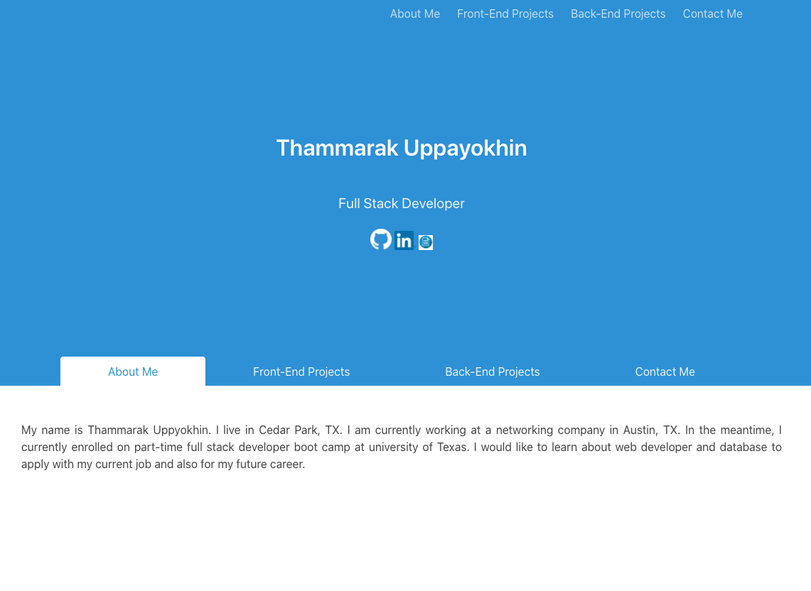

# Homework 07 - homework_07_portfolio_new

## Objective : 
updating your portfolio page and other materials to build toward being employer competitive.
- update with project 1 and two exemplary homework assignments.
- update GitHub profile with pinned repositories featuring project 1 and two exemplary assignments
- add a link to download resume
- add LinkedIn profile
### Github Repository URL
https://github.com/thammaraku/homework_07_portfolio_new

### Github Page URL
This will become my official portfolio page.
https://thammaraku.github.io/homework_07_portfolio_new/

### ScreenShot

## License
No license required on this public web page.